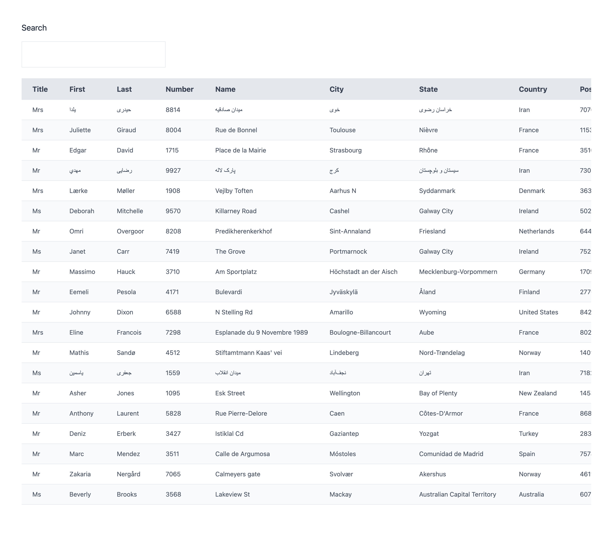

⚠️ Please note that this is an old project and does not reflect the quality of my current work.

# React Dynamic Table

A dynamic table with search and sort functionality.

## Description

A dynamic table that displays data fetched from an external service in a table with search and sort features.

The back-end acts as a proxy server that is responsible for making requests to an external API and formatting the response.

## Motivation

I built this application to practice using TypeScript in React and to build something new and learn a few things.

## Technologies

- TypeScript.
- React.
- Node.
- Express.
- Random User API.

---

This project was bootstrapped with [Create React App](https://github.com/facebook/create-react-app).

### Available Scripts

In the project directory, you can run:

#### `npm start`

Runs the app in the development mode.\
Open [http://localhost:3000](http://localhost:3000) to view it in the browser.

The page will reload if you make edits.\
You will also see any lint errors in the console.

#### `npm test`

Launches the test runner in the interactive watch mode.\
See the section about [running tests](https://facebook.github.io/create-react-app/docs/running-tests) for more information.

#### `npm run build`

Builds the app for production to the `build` folder.\
It correctly bundles React in production mode and optimizes the build for the best performance.

The build is minified and the filenames include the hashes.\
Your app is ready to be deployed!

See the section about [deployment](https://facebook.github.io/create-react-app/docs/deployment) for more information.

